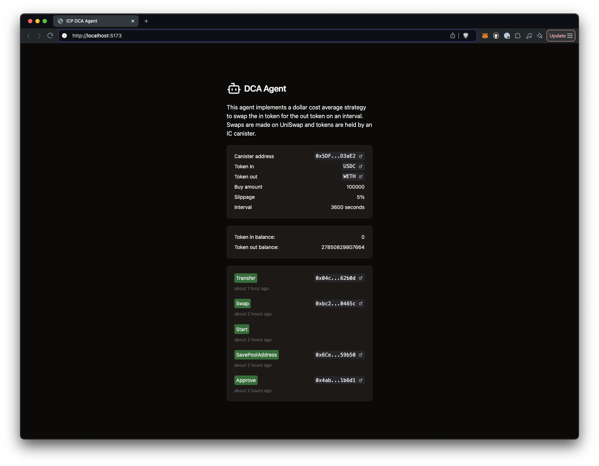

# DCA Agent example

This Dollar Cost Average agent runs on an interval specified by the user to swap
a set amount of in tokens to some out tokens. The agent runs as a smart contract
on the Internet Computer and swaps ERC-20 tokens using Uniswap.

The backend consists of a Rust canister uses the
[ic-alloy](https://github.com/ic-alloy) library to interact with the Ethereum
blockchain. The frontend is built with React and Vite.

[![Contributors][contributors-shield]][contributors-url]
[![Forks][forks-shield]][forks-url] [![Stargazers][stars-shield]][stars-url]
[![Issues][issues-shield]][issues-url] [![MIT License][license-shield]](LICENSE)

> [!TIP]
> Use this repository as a starting point for building your own timer
> based Ethereum agents on the Internet Computer.

> [!IMPORTANT]
> This repository is a work in progress. Expect breaking changes, bugs and incomplete features. More documentation will also be added. 



## Setup

There are two main ways to set up the dev environment:

### 1. Using a VS Code Dev Container

The dev containers extension lets you use a Docker container as a full-featured
development environment. This repository includes a dev container configuration
that you can use to open the project with all the necessary tools and
dependencies pre-installed.

Pre-requisites:

- [Docker](https://www.docker.com/products/docker-desktop)
- [Visual Studio Code](https://code.visualstudio.com/)
- [Dev Containers Extension](https://marketplace.visualstudio.com/items?itemName=ms-vscode-remote.remote-containers)

Once Docker, Visual Studio Code and the Dev Containers Extension are installed,
you can open the project in a container by clicking the button below:

[](https://vscode.dev/redirect?url=vscode://ms-vscode-remote.remote-containers/cloneInVolume?url=https://github.com/ic-alloy/ic-alloy-dca)

### 2. Setup manually

Pre-requisites:

- [Local Internet Computer dev environment](https://internetcomputer.org/docs/current/developer-docs/backend/rust/dev-env)
- [pnpm](https://pnpm.io/installation)

Once you have the prerequisites installed, you can clone this repository and run
the project.

## Running the project

### 1. Start the Internet Computer

```bash
dfx start --background
```

### 2. Deploy the evm-rpc canister

```
dfx deploy evm-rpc
```

### 3. Deploy the DCA canister

The backend canister is deployed using a script. Edit the deploy script to change the
default values.

Default values:
```bash
dfx deploy backend --argument "(
  record {
    owner = \"$(dfx identity get-principal)\";
    token_in_address = \"0x1c7D4B196Cb0C7B01d743Fbc6116a902379C7238\";
    token_in_name = \"USDC\";
    token_out_address = \"0xfff9976782d46cc05630d1f6ebab18b2324d6b14\";
    token_out_name = \"WETH\";
    fee = 3000;
    amount_in = 100000;
    slippage = 5;
    interval = 3600;
  }
)" $network
```

Deploy:
```
bash scripts/deploy-backend.sh
```

### 4. Deploy the frontend

```
pnpm install
dfx deploy frontend
```

## Develop

During development, you can run the frontend with hot reloading using Vite.

```bash
pnpm run dev
```

## Contributors

<!-- readme: collaborators,contributors -start -->
<table>
	<tbody>
		<tr>
            <td align="center">
                <a href="https://github.com/kristoferlund">
                    
                    <br />
                    <sub><b>Kristofer</b></sub>
                </a>
            </td>
		</tr>
	<tbody>
</table>
<!-- readme: collaborators,contributors -end -->

## License

This project is licensed under the MIT License. See the LICENSE file for more
details.

## Contributing

Contributions are welcome! Please open an issue or submit a pull request if you
have any suggestions or improvements.


[contributors-shield]:
  https://img.shields.io/github/contributors/ic-alloy/ic-alloy-dca.svg?style=for-the-badge
[contributors-url]:
  https://github.com/ic-alloy/ic-alloy-dca/graphs/contributors
[forks-shield]:
  https://img.shields.io/github/forks/ic-alloy/ic-alloy-dca.svg?style=for-the-badge
[forks-url]: https://github.com/ic-alloy/ic-alloy-dca/network/members
[stars-shield]:
  https://img.shields.io/github/stars/ic-alloy/ic-alloy-dca?style=for-the-badge
[stars-url]: https://github.com/ic-alloy/ic-alloy-dca/stargazers
[issues-shield]:
  https://img.shields.io/github/issues/ic-alloy/ic-alloy-dca.svg?style=for-the-badge
[issues-url]: https://github.com/ic-alloy/ic-alloy-dca/issues
[license-shield]:
  https://img.shields.io/github/license/ic-alloy/ic-alloy-dca.svg?style=for-the-badge
[license-url]:
  https://github.com/ic-alloy/ic-alloy-dca/blob/master/LICENSE.txt

